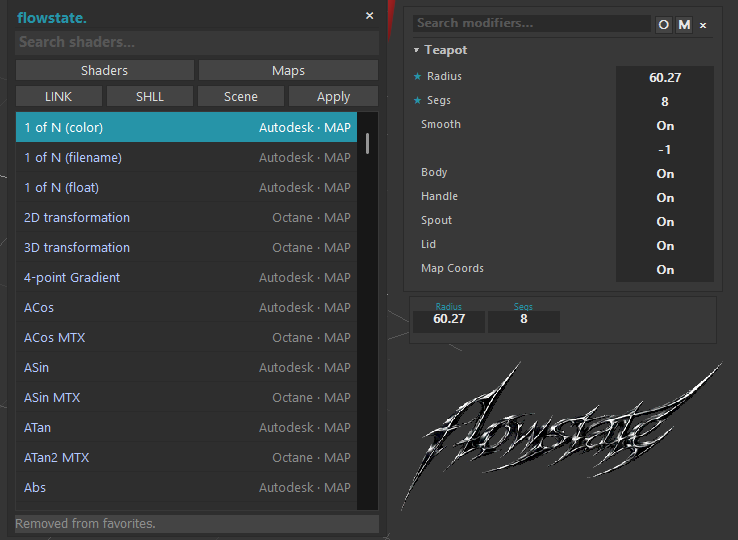

# flowstate


flowstate 1.3 is a collection of 3ds Max tools for faster parameter editing, shader creation, modifier access, modeling, and mouse-driven viewport workflows.

## Install

1. Copy the matching `FlowState.gup` build to `3ds Max <version>\plugins`.
2. Drag `flowstate_config.ms` to viewport.
3. Restart 3ds Max.

Release packages require both `FlowState.gup` and `flowstate_config.ms`.

## Quick Start

### Shader Search Utility

- Search materials, maps, scene shaders and OSL
- Open with TAB key in SME or Shift+M5 anywhere
- Start typing to search
- Right Click to pin to list
- Middle Click to pin to brick
- Drag and Drop to any slot, object, or SME location
- Right Click a pinned brick to rename it (max 4 chars)
- SHLL button creates a shell material for textured viewports for renderers that fail to display nitrous textures. Right click to change bitmap resolution.
- LINK button links U and V tile of bitmap nodes (including uberbitmap)

### Floating Modifier Stack

- Shows object, modifier and Editable Poly parameters
- Open with Mouse5 or via hotkey
- Click on a parameter to type a value
- Enter or Tab applies typed value
- Drag on a parameter to change it
- Scroll on a parameter for small changes
- Hold Shift for 10x or Alt for 0.1x while dragging
- Right Click on a parameter to pin it
- Esc cancels and closes
- Hit the O button in the panel to hide parameters completely


### Auto Orbit

- Ctrl+M5 to cycle Orbit / Selected / POI / Dynamic / Off
- Dynamic switches between POI and Selected depending on your selection
- All modes are in Hotkey Editor too

### Macro Search

- Open with the M button in Floating Modifier Stack or via hotkey
- Search modifiers and macros
- Enter adds the modifier or runs the macro
- Delete removes top modifier
- Middle Click a modifier to add it to quick access

### Mouse Slider Macros

- Mouse4 to Screen Grab
- Shift+M4 to Time Slider
- Ctrl+M4 to Param Slider
- Ctrl+Shift+M4 to Opacity Slider
- Alt+M4 to UV Grab
- Ctrl+Alt+Shift+M4 to clear parameter sliders
- Alt+Shift+M5 swaps vertical and horizontal parameters
- Change any combo in Config
- Turn off Mouse Slider Macros in Config to release both side buttons

### Smooth Bridge

- Editable Poly only
- Select 2 open edge loops with the same amount of verts
- Run Smooth Bridge from CloneTools
- Use Smooth A / B for continuity and Flip if bridge twists

### F2 Extend

- Editable Poly only
- Select an open edge and run F2 Extend
- Select 2 verts to connect or 3+ verts to make a face
- Select the new edge again if you want to keep extending

### Loop Subdivision

- Add it from modifier list or Macro Search
- Made for triangle meshes
- Increase Iterations to smooth it

### Normalize Poly

- Add it from modifier list or Macro Search
- Threshold controls how many straight verts it catches
- Keep Select Only on to preview them
- Turn Select Only off to remove them

## Interface
- 


## Issues

- When creating materials/maps in SME make sure to drag and drop from the menu, otherwise it will create at SME origin.
- Auto Orbit requires Autocam.gup to exist. If you removed it please restore it, otherwise automatic orbit will not work. If you don't know what I am talking about just ignore what I said.
- F2 Extend can fail with weird angles.
- Screen Grab and UV Grab are work in progress so avoid using them as they're buggy.
- Dynamic POI is a literal hack, it can show wrong cursor for a split second and it uses polling. Other modes are much cleaner.

## Build

Requires Visual Studio 2022, CMake 3.20+, and the SDK matching the target 3ds Max version.

```powershell
cmake -S . -B build -G "Visual Studio 17 2022" -A x64 -DMAX_VERSION=2026
cmake --build build --config Release
```

Set `MAX_VERSION=2027` or override `MAXSDK_PATH` for another supported SDK; the Release output places the GUP and config script together.

### Native source layout

| Area | Sources |
| --- | --- |
| Core module and exports | `src/flowstate.cpp`, `src/FlowState.def` |
| Floating editors | `src/powershader.*`, `src/modstack.*` |
| Modeling commands | `src/normalize_edges/f2_extend_tool.cpp`, `smooth_bridge_tool.cpp` |
| Normalize Poly modifier | `src/normalize_edges/normalize_poly.*` |
| Loop Subdivision modifier | `src/modifiers/loop_subdivision/` |

The CMake project groups those areas explicitly while linking them into the single `FlowState` target.

## Uninstall

Remove `FlowState.gup`, the installed `flowstate_config.ms` copies/startup loader, and optionally `<plugcfg>\FlowState.cfg`.

## License

GPL-3.0 with an Autodesk 3ds Max SDK linking exception; see [LICENSE](LICENSE) and [LICENSE-EXCEPTION](LICENSE-EXCEPTION).

Copyright (C) 2026 clone
